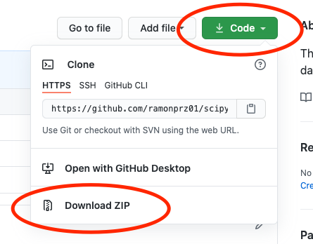
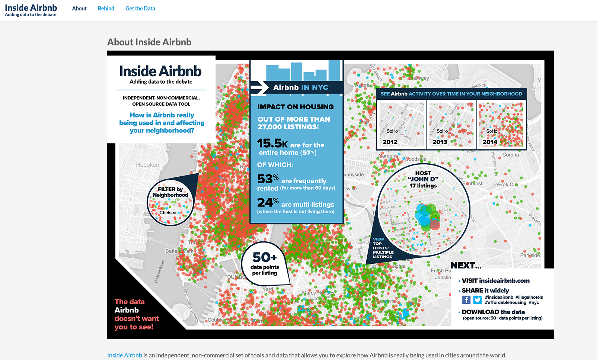

# (D)Ask Me Anything About Data Analytics at Scale
==============================

Tutorial on Large Scale Data Analytics - SciPy US 2021

### Date: July 13th from 2 to 6pm CDT

## SciPy US 2021

Welcome to ___(D)Ask Me Anything About Data Analytics at Scale___, a SciPy US 2021 tutorial where we will be learning about how to conduct exploratory data analysis at scale, how to create dashboards with data that does not fit in memory, and how to do hypothesis testing.

**Important Note:** The current repo only contains the instructions to get set up and ready for the tutorial on July 13th from 2 to 6pm CDT. The **notebooks**, **the presentation**, **the data**, and a **binder link**, in case you prefer to use a cloud environment for the tutorial, will be available on or before July 9th.

# Table of Contents

1. Outline for the Tutorial
2. Prerequisites
3. Goals/Learning Outcomes
4. Setup
5. Presentation (link below)
6. Data
7. Notebooks
    - 00 Flash Intro
    - 01 Static Dashboards
    - 02 Interactive Dashboars
    - 03 Dashboard Deployment
8. Acknowledgements
9. Resources
10. Feedback 😃

Run this tutorial on Binder

[]()

## 1. Outline for the Tutorial

The time budgeted for this tutorial is about 3.5 hours including breaks. We will follow, as best as possible, the following schedule.
1. **Introduction and Setup | 2:00 - 2:30 (Central/US)**
   - Getting the environment set up. We will be using Jupyter Lab and some of the libraries in the Python scientific stack throughout the tutorial. If you experience any difficulties getting fully setup for the lessons ahead, please let me know as soon as possible. Otherwise, I know that having zoom and using all of the cores in your machine can make things slow down quite dramatically, and because of this, you can also access all of the content for the session through Binder using the link above and we can work on your setup during the break.
	 - Presentation including
		 - A breakdown of the session
		 - Exploratory Data Analysis
		 - Questions to be Tackled
		 - Hypothesis Testing
		 - Dashboards
		 - Intro to the tools for the session
2. **Flash Intro to Dask | 2:30 - 2:50 (Central/US)**
	- In this section, we will cover some of the basic building blocks for working with dask dataframes.
3. **10-minute break**
4. **Exploratory Data Analysis | 3:00 - 3:45 (Central/US)**
   - Questions and Answers
   - EDA Breakdown
	   - Analysis and
	   - Visualisations
   - Exercise (10-min)
5. **15-minute break**
6. **Hypothesis Testing | 4:00 - 4:40 (Central/US)**
   - The Dashboard
   - Scenario
   - Use Cases
   - Exercise (7-min)
7. **10-minute break**
8. **Dashboards | 4:50 - 5:40 (Central/US)**
	-  Interactive dashboard overview
	-  Datashader and Holoviews overview
	-  Top-Down Interactive Dashboard Breakdown
	-  Exercises (10-min). For these exercises, you will be given a dashboard with 3-5 visualizations as well as the dataset, and your task is to reverse engineer any of the visualizations in the dashboard using Dask, datashader, and holoviews


## 2. Prerequisites (P) and Good To Have's (GTH)

The target audience for this session includes analysts of all levels, developers, data scientists, and engineers wanting to learn how to analyze large amounts of data that don’t fit into the memory RAM of their computers.

The tutorial is at the intermediate level and the following are some of the Prerequisites (P) and Good To Have's (GTH)

  - **(P)** 1 year of coding in Python.
  - **(P)** Participants should be comfortable with loops, functions, lists comprehensions, and if-else statements.
  - **(GTH)** While it is not necessary to have knowledge of dask, pandas, NumPy, datashader, and Holoviews, a bit of experience with (or some exposure to) these libraries would be very beneficial throughout the tutorial
  - **(P)** Please make sure to have at least 10 GB of free space in your computer.
  - **(GTH)** While it is not required to have experience with an integrated development environment like Jupyter Lab, this would be very beneficial for the session as it is the tool we will be using all throughout.

## 3. Goals/Learning Outcomes

It is okay to not understand absolutely everything in the tutorial, instead, I would like to challenge you to first, make sure you walk away with at least 2 new concepts from this lesson, and second, that you come back to it and go over the content you did not get the first time around. That would be one of the best ways to reinforce your understanding of of the concepts covered in this session.

With that said, by the end of the tutorial you will:

1. Have a better understanding of EDA and Hypothesis Testing.
2. Add a new tool for large scale data analysis to your toolkit.
3. Have a better understanding on how to conduct data analysis at scale with Python.
4. Understand the process for breaking apart dashboards and putting them back together with Python.
5. Be able to find a process for looking at data visualizations and figure out a way to break them down and reproduce them.

## 4. Setup

You should first make sure you have [Anaconda](https://www.anaconda.com/products/individual#download-section) or [Miniconda](https://docs.conda.io/en/latest/miniconda.html) installed. This will allow you to have most of the packages you will need for this tutorial already installed once you open up Jupyter Lab.

Here are some of the ways in which you can get the setup for the tutorial ready.

### 4.1 Option 1

#### First Step

Open up your terminal and navigate to a directory of your choosing in your computer. Once there, run the following command.

```sh
 git clone https://github.com/ramonpzg/scipyus21_dask_analytics.git
```

Conversely, you can click on the green `download` button at the top and donwload all files to your desired folder/directory. Once you download it, unzip it and move on to the second step.

#### Second Step

To get all dependancies, packages and everything else that would be useful in this tutorial, you can recreate the environment by first going into the directory for today

```sh
cd scipyus21_dask_analytics
```

and then running

```sh
conda env create -f environment.yml
```

#### Third Step

Then you will need to activate your environment using the following command.

```sh
conda activate us_scipy21
```

#### Fourth Step

Open up Jupyter Lab and you should be ready to go.

```sh
jupyter lab
```


### 4.2 Option 2

#### First Step

Download the repo using the big green button on the upper right.



#### Second Step

Open a Jupyter Lab session inside the folder you just downloaded. You can do this through the Anaconda graphical user interface if you are on a Mac or Windows.

```sh
cd scipyus21_dask_analytics
jupyter lab
```

Conversely, open a Jupyter Lab session anywhere you'd like and navigate to the folder you just downloaded.

#### Third Step

Open up a terminal inside of Jupyter Lab and run either of the following commands.

```sh
## one option
pip install -U pandas numpy dask bokeh pyarrow parquet matplotlib scipy seaborn holoviews geoviews panel geopandas datashader

## another option
conda install pandas numpy dask bokeh pyarrow parquet matplotlib scipy seaborn holoviews geoviews panel datashader geopandas -c conda-forge
```

If you receive an error while trying to install all packages, close out of jupyter lab, shut down your serrver, and follow the steps below.

```sh
## create an environment
conda create --name my_env_name python=3.9 pip

## activate your environment
conda activate my_env_name

## install some packages
pip install -U pandas numpy dask bokeh pyarrow parquet matplotlib scipy seaborn jupyterlab

## install the holoviz suite one by one
conda install -c pyviz panel -y
conda install -c pyviz holoviews -y
conda install -c pyviz geoviews -y
conda install datashader -y
conda install -c ioam param -y
conda install -c pyviz hvplot -y
conda install geopandas -y

## open up jupyter lab
jupyter lab
```

Great work! Now navigate to notebook 01 and open it.


## 5. Presentation

Link to Presentation (**Upcomming!**)


## 6. Data

For this tutorial, we will be using the following datasets.

Airbnb Data



We will be using Airbnb data collected by a scraping tool called [Inside Airbnb](http://insideairbnb.com/about.html). The tool periodically scrapes data from Airbnb and publishes it for free on its website.

The data differs slightly (or by a lot) from country to country, and from time-frame to time-frame. Niether fact should be surprising, the former might be due to different countries having different regulations that may or may not prevent Airbnb from posting the same information regarding a listing. The latter makes sense as we would expect Airbnb to continue to improve its business from year-to-year and change the information collected from a listing and its host.

You can download all datasets using the following link. (**Upcoming!**)


## 7. Notebooks

The tutorial is contains a presentation and the following notebooks.

- **00 Flash Intro** - A quick introduction to Dask and some of its major APIs.
- **01 Exploratory Data Analysis** - this notebook covers exploratory data analysis and visualisation at scale.
- **02 Hypothesis Testing** - This notebook gives an overview on how to do hypothesis testing at scale.
- **03 Dashboards** - In this notebook we will cover how to decunstruct and put back together an interactive dashboard that we can share with friends and colleagues.

## 8. Acknowledgements

The work in this tutorial was made possible because of the many talented people who have invested invaluable time and effort in building these great tools for the Python ecosystem. Many thanks to the core developers of dask, HoloViz, pandas, NumPy, bokeh, and all others teams from libraries that I have not mentioned.

## 9. Additional Resources

Here are a few great resources to get started with data analytics, data visualisation, and dashboard creation. The first three, in particular, have guided my thinking and helped very much polished the content you have found in this tutorial.

- [Data Science with Python and Dask](https://www.manning.com/books/data-science-with-python-and-dask?query=dask) by Jesse C. Daniel
- [Fundamentals of Data Visualisation](https://clauswilke.com/dataviz/) by Claus O. Wilke
- [The Big Book of Dashboards](http://bigbookofdashboards.com/) by Steve Wexler, Jeffrey Shaffer, and Andy Cotgreave
- [# Practical Statistics for Data Scientists: 50+ Essential Concepts Using R and Python](https://www.amazon.com.au/Practical-Statistics-Data-Scientists-2e/dp/149207294X/ref=sr_1_1?dchild=1&keywords=Practical+Statistics+for+Data+Scientists+second+edition&qid=1624278273&s=books&sr=1-1) by Peter Bruce, Andrew Bruce, and Peter Gedeck
- [Python for Data Analysis: Data Wrangling with Pandas, NumPy, and IPython](https://www.amazon.com/gp/product/1491957662/ref=as_li_qf_asin_il_tl?ie=UTF8&tag=quantpytho-20&creative=9325&linkCode=as2&creativeASIN=1491957662&linkId=ea8de4253cce96046e8ab0383ac71b33) by Wes McKinney

## 10. Feedback 😃

If you liked or disliked this tutorial and would like to give me your feedback so that I can improve it, I would greatly appreciate that.

> # [Feedback Form](https://docs.google.com/forms/d/e/1FAIpQLSd5xBzNFs0XDLFfV07ibCGOLwaE6M8JFnGOBRlwlg__Bjzm5w/viewform?usp=sf_link)
