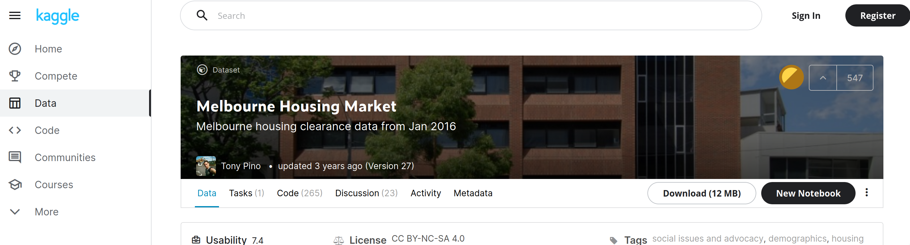

# (D)Ask Me Anything About Data Analytics at Scale
==============================

Tutorial on Large Scale Data Analytics - SciPy US 2021

## SciPy US 2021

Welcome to ___(D)Ask Me Anything About Data Analytics at Scale___, a SciPy 2021 tutorial where we will be learning about how to deconstruct static and dynamic dashboards and put new ones together; how to save dashboards for the purpose of sharing them with colleagues and friends, and how to share our insights in a deployed version of our interactive dashboards.

# Table of Contents


1. Outline for the Tutorial
2. Prerequisites
3. Goals/Learning Outcomes
4. Setup
5. Presentation (link below)
6. Data
7. Notebooks
    - 01 Static Dashboards
    - 02 Interactive Dashboars
    - 03 Dashboard Deployment
8. Acknowledgements
9. Resources
10. Feedback 😃

Run this tutorial on Binder

[](https://mybinder.org/v2/gh/ramonprz01/pycon21-dashboards-4-all/master)

## 1. Outline for the Tutorial

The time budgeted for this tutorial is about 3.5 hours including breaks. The tutorial will follow, as best as possible, the following schedule.
1. **Introduction and Setup | 3:00 - 3:25 (Eastern/US)**
   - Getting the environment set up. We will be using Jupyter Lab and some of the libraries in the Python scientific stack throughout the tutorial. If you experience any difficulties getting the set up going, please let me know as soon as possible. Otherwise, you can also access all of the content through Binder using the following link and we can work on your setup during one of the breaks.
   - Presentation including
     - A breakdown of the session
     - Introduction to DataViz
     - Introduction to Dashboards
     - Intro to the tools for the session
2. **5-minute break**
3. **Static Dashbords | 3:30 - 4:20 (Eastern/US)**
   - The Dashboard
   - Scenario
   - Use Cases
   - The Data
   - Top-Down Static Dashboard Breakdown
   - Exercise (7-min)
4. **10-minute break**
5. **Interactive Dashboards | 4:30 - 5:20 (Eastern/US)**
   - The Dashboard
   - Scenario
   - Use Cases
   - The Data
   - Top-Down Interactive Dashboard Breakdown
   - Exercise (7-min)
6. **15-minute break**
7. Deploying Dashboard | 5:35 - 6:30 (Eastern/US)
   - Scenario
   - Intro to the dataset
   - Mixed dashboard creation and deployment
   - Deployment Elements Breakdown
   - Deployment
   - Exercise (7-min)


## 2. Prerequisites (P) and Good To Have's (GTH)

- **(P)** Attendees for this tutorial are expected to be familiar with Python (1 year of coding). 
- **(P)** Participants should be comfortable with loops, functions, lists comprehensions, and if-else statements.
- **(GTH)** While it is not necessary to have knowledge of dask, pandas, NumPy, bokeh, and Holoviews, a bit of experience with these libraries would be very beneficial throughout this tutorial.
- **(P)** Participants should have at least 6 GB of free memory in their computers.
- **(GTH)** While it is not required to have experience with an integrated development environment like Jupyter Lab, this would be very beneficial for the session


## 3. Goals/Learning Outcomes

It is okay to not understand absolutely everything in the tutorial, instead, I would like to challenge you to first, make sure you walk away with at least 2 new concepts from this lesson, and second, that you come back to it and go over the content you did not get the first time around and reinforce your understanding of it.

With that said, by the end of the tutorial you should be able to:

1. Introduce an accessible way to reproduce dashboards
2. Help you find a process for looking at data visualizations and figure out a way to break them down and reproduce them
3. Create static dashboards that you can share with friends and colleagues
4. Create interactive dashboards that your users can use to see different stories from the data

## 4. Setup

You should first make sure you have [Anaconda](https://www.anaconda.com/products/individual#download-section) or [Miniconda](https://docs.conda.io/en/latest/miniconda.html) installed. This will allow you to have most of the packages you will need for this tutorial already installed once you open up Jupyter Lab.

Here are some of the ways in which you can get the setup for the tutorial ready.

### 4.1 Option 1

#### First Step

Open up your terminal and navigate to a directory of your choosing in your computer. Once there, run the following command.

```sh
 git clone https://github.com/ramonprz01/pycon21-dashboards-4-all.git
```

Conversely, you can click on the green `download` button at the top and donwload all files to your desired folder/directory. Once you download it, unzip it and move on to the second step.

#### Second Step

To get all dependancies, packages and everything else that would be useful in this tutorial, you can recreate the environment by first going into the directory for today

```sh
cd pycon21
```

and then running

```sh
conda env create -f environment.yml
```

#### Third Step

Then you will need to activate your environment using the following command.

```sh
conda activate pycon-d4a
```

#### Fourth Step

Open up Jupyter Lab and you should be ready to go.

```sh
jupyter lab
```


### 4.2 Option 2

#### First Step

Download the repo using the big green button on the upper right.


#### Second Step

Open a Jupyter Lab session inside the folder you just downloaded. You can do this through the Anaconda graphical user interface if you are on a Mac or Windows.

```sh
cd pycon21
jupyter lab

```

Conversely, open a Jupyter Lab session anywhere you'd like and navigate to the folder you just downloaded.

#### Third Step

Open up a terminal inside of Jupyter Lab and run either of the following commands.

```sh
## one option
pip install -U pandas numpy dask bokeh pyarrow parquet matplotlib scipy seaborn holoviews geoviews panel geopandas

## another option
conda install pandas numpy dask bokeh pyarrow parquet matplotlib scipy seaborn holoviews geoviews panel geopandas -c conda-forge
```

If you receive an error while trying to install all packages, follow the steps below.

```sh
## create an environment
conda create --name my_env_name python=3.9 pip

## activate your environment
conda activate my_env_name

## install some packages
pip install -U pandas numpy dask bokeh pyarrow parquet matplotlib scipy seaborn geopandas

## install the holoviz suite one by one
conda install -c pyviz panel -y
conda install -c pyviz holoviews -y
conda install -c pyviz geoviews -y
conda install datashader -y
conda install -c ioam param -y
conda install -c pyviz hvplot -y
```

Great work! Now navigate to notebook 01 and open it.


## 5. Presentation

Link to Presentation


## 6. Data

For this tutorial, we will be using the following datasets.

- Domain’s Melbourne Housing Market



This dataset contains information about housing auctions from 2016 to 2017 in the metropolitan area of Melbourne, Victoria, Australia. The data was scraped from Domain, a popular properties solutions website.

- Sydney Airbnb Data


We will be using Airbnb data collected by a scraping tool called [Inside Airbnb](http://insideairbnb.com/about.html). The tool periodically scrapes data from Airbnb and publishes it for free on its website.

The data differs slightly (or by a lot) from country to country, and from time-frame to time-frame. Niether fact should be surprising, the former might be due to different countries having different regulations that may or may not prevent Airbnb from posting the same information regarding a listing. The latter makes sense as we would expect Airbnb to continue to improve its business from year-to-year and change the information collected from a listing and its host.

You can download all datasets using the following link.

Create a folder called `data` and add to it the folders in the following link using their respective names, `static` and `interactive`. Please make sure to add this new directory to the same folder you will be using for this tutorial.

### [LINK to the Data](https://web.tresorit.com/l/fk31I#ojoRDOFvtbWXSxiAmSF1sw)

## 7. Notebooks

The tutorial is contains a presentation and the following notebooks.

- **01 Static Dashboards** - In this notebook we will cover how to decunstruct and put back together a static dashboard to share with friends and colleagues.
- **02 Interactive Dashboars** - In this notebook, we will get a bit more technical and add interactive components to our dashboard as we deconstruct it and put it back together.
- **03 Dashboard Deployment** - This notebook is all about how to create a small application with our dashboards.


## 8. Acknowledgements

The work in this tutorial was made possible because of the many talented people who have invested invaluable time and effort in building these great tools for the Python ecosystem. So many thanks to the pandas, NumPy, bokeh, HoloViz, and all others teams who I have not mentioned.

## 9. Additional Resources

Here are a few great resources to get started with data analytics, data visualisation, and dashboard creation. The first three, in particular, have guided my thinking and helped very much polished the content you have found in this tutorial.

- [Fundamentals of Data Visualisation](https://clauswilke.com/dataviz/) by Claus O. Wilke
- [The Big Book of Dashboards](http://bigbookofdashboards.com/) by Steve Wexler, Jeffrey Shaffer, and Andy Cotgreave
- [Python for Data Analysis: Data Wrangling with Pandas, NumPy, and IPython](https://www.amazon.com/gp/product/1491957662/ref=as_li_qf_asin_il_tl?ie=UTF8&tag=quantpytho-20&creative=9325&linkCode=as2&creativeASIN=1491957662&linkId=ea8de4253cce96046e8ab0383ac71b33) by Wes McKinney

## 10. Feedback 😃

If you liked or disliked this tutorial and would like to give me your feedback so that I can improve it, I would greatly appreciate that.

> # [Feedback Form](https://docs.google.com/forms/d/e/1FAIpQLSdktVFANUw0uTsjXXgUcR2zRIW7RYt0uC-0FWnr3V2nYoXfjQ/viewform?usp=sf_link)
